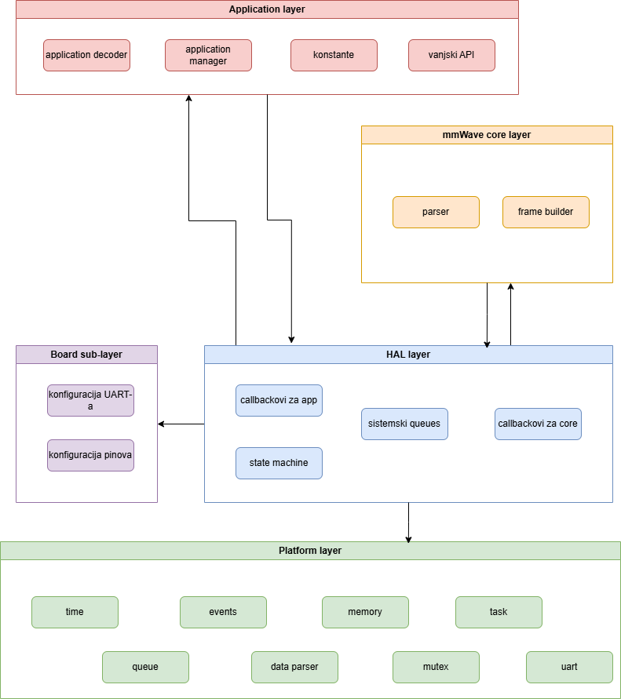
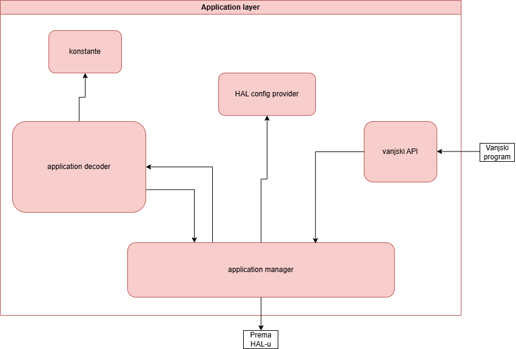

# Zadatak i cilj projekta

Zadatak ovog projekta bila je implementacija drivera u C-u koji omogućuje čitanje podataka i osnovnu konfiguraciju drivera koji
upravlja mmWave senzorom. Takav driver nudi API za rad s mmWave senzorom koji je platform-independent u svojem većem dijelu.

Cilj je razviti driver koji je što više portabilan, tako da se većina koda može koristiti neovisno o platformi i mikrokontroleru
koji bi izvršavali takav kod. Ovakav pristup olakšava testiranje, povećava ponovnu iskoristivost koda i značajno utječe na široku
mogućnost polja na kojima se driver može primjenjivati.

# Opis razvijenog proizvoda

Driver ima mogućnosti inicijalizacije, pokretanja i gašenja sustava, te slanja upita (inquiry) i primanja podataka (konkretno,
podataka o udaljenosti, kretanju i aktivnosti osobe u nekom prostoru) preko UART sučelja. Konfiguracija senzora (postavljanje modova, sensitivitija, načina čitanja podataka, ali i osnovno konfiguriranje) vrši se preko vanjskog uniformnog API-ja.

Driver počiva na portabilnoj arhitekturi podjeljenoj na četiri glavna sloja. Svaki sloj ima važnu ulogu i samostalno obavlja određenu funkcionalnost sustava, ali slojevi su povezani i moraju komunicirati kako bi se uspješno prenijeli zahtjevi i podatci, te kako bi sustav normalno funkcionirao.

Ta četiri glavna sloja su:
* Platform sloj
* Hardware Abstraction Layer (HAL) sloj
* Mmwave core sloj
* Application sloj

 

**Platform sloj** - odgovoran za pristup hardware-u, implementira osnovne low-level funkcije (upravljanje dinamičkom memorijom, time, queue, eventi, taskovi, UART) koje ostali slojevi koriste pozivanjem platform sloja. API platform sloja je platform-independent, dok se njegova implementacija mijenja ovisno o platformi.

**HAL sloj** - "ljepilo sloj" - odgovoran za povezivanje ostalih slojeva. HAL sloj ponaša se kao sabirnica podataka i vlasnik je sve memorije i struktura podataka koje se koriste u driveru za obradu podataka. Kroz njega se događa protok podataka od senzora, preko core sloja (parser) pa sve do aplikacijskog sloja. Također, služi kao podloga core i application sloju za spremanje i dohvaćanje podataka.

**Mmwave core sloj** - poznaje protokol i vrši sve operacije za koje je potrebno znanje protokola kojim mmwave senzor šalje podatke. Glavne funkcionalnosti su parsiranje podataka i stvaranje okvira za upite. Core sloj je potpuno platform-independent jer jedine funkcije koje ovise o platformi obavlja preko HAL callbackova.

**Application sloj** - krovni sloj koji služi za semantičko tumačenje podataka. Dakle, sloj se koristi kao dekoder onaj koji "razumije" što bajtovi (posebno payload) iz okvira znače, te razdvaja odgovore na upite (response) i aktivne izvještaje (report). Također, ovaj sloj izlaže API vanjskom korisniku - tj. on je izlazna točka drivera. Sam sloj sastoji se od više podslojeva - managera (upravlja application slojem i razgovara s HAL-om), decodera podataka, izlaznog podsloja i config podsloja (samo definira konfiguracije za HAL i core). Svi ti podslojevi moraju biti prisutni kako bi application sloj normalno funkcionirao.

Dodatno, driver koristi pomoćni sloj koji samo definira konstante vezane uz konkretne pinove i specifikacije mikrokontrolera i njihovih komunikacijskih sustava - **board pomoćni sloj**.

Upravo ta podjela na slojeve pruža modularnost i ponovnu iskoristivost koda, jer za prilagodbu za novu platformu, komunikacijsko sučelje ili protokol senzora potrebne su minimalne promijene koda. U tom slučaju potrebno je dodati nove implementacije platform API-ja, djelomične promjene na HAL sloju i drugačije konstante u board pomoćnom sloju. Svi ostali djelovi sustava ostaju isti i ne zahtjevaju nikakve promijene.

Razvijeni driver je user-friendly i lagan za korištenje jer API koji komunicira s vanjskim programom ne zahtjeva nikakvo poznavanje implementacije sustava, iako se mora znat što koji podataka predstavlja (nema posebnih tipova za određene podatke senzora na application sloju).

# Tehničke značajke

Sustav je dizajniran kao portabilni C driver s izoliranim platform-independent djelovima, što omogućuje lagano proširenje funkcionalnosti, ponovnu uporabu koda, ali i promijenu platforme.

Sustav počiva na platform sloju, čiji je API platform-independent, ali implementacija podložna platformi. Tu se većina promijena kod prelaska sustava na drugačiji mikrokontroler ili platformu mora obaviti. Platform sloj obavlja low-level funkcije kao što su: funkcije za upravljanje dinamičkom memorijom (alokacija i free), taskovi (stvaranje, brisanje, delay, promijena prioriteta), sinkronizacija taskova (mutex funkcije), queue (stvaranje, dodavanje, dohvaćanje i brisanje), uart (inicijalizacija, pisanje, čitanje, ISR, deinicijalizacija) i upravljanje eventima (struktura eventa, stvaranje eventa, čekanje na eventove, ISR event management, ...).

HAL sloj obavlja širok spektar funkcionalnost. Jedna od tih funkcija je vlasništvo nad sustavskim strukturama podataka (svi queue-ovi koje sustav koristi se stvaraju, upravljaju i brišu u HAL sloju). Sljedeća važna funkcionalnost koju on vrši je upravljanje dodijelom memorije i zaštita sustava od prevelike (štetne) alokacije. HAL sloj također vrši usklađivanje rada application sloja i core sloja, pošto on interno drži state machine koja predstavlja stanje sustava. Kako bi se omogućila što veća neovisnost application sloja i core sloja o platformi, HAL sloj pruža podlogu preko koje ti slojevi mogu obavljati operacije nad sustavskim strukturama, i to, konkretno korištenjem callbackova. HAL sloj djelomično je neovisan o platformi - API mu je generaliziran, ali implementacija izravno koristi platform sloj i njegove mehanizme, te on izravno drži strukture podataka koje se razlikuju s obzirom na platoformu.

Poseban dio drivera svakako predstavlja core sloj, koji implementira najvažniju funkcionalnost sustava - parser. Taj sloj potpuno je neovisan o platformi, te sve svoje funkcionalnosti dohvaćanja i spremanja podatka vrši preko HAL callbackova. Parser pamti stanje u kojem se je nalazio, stoga je pogodan za obradu tokova koji šalju djelomične okvire. Uz to, parser ima interne restart funkcije i sustave koji mu omogućuju oporavak u slućaju redundantnih bajtova na početku ili kraju toka podataka koji prima. Uz funkciju parsiranja, core sloj obavlja i funkcionalnost izgradnje okvira iz samo semantički korisnih podataka, što je iznimno važno za slanje upita na senzor.

Konačno - zadnji, aplikacijski sloj sam u sebi se ponaša kao manji sustav, pošto se sastoji od više djelova. Najvažniji dio tog sloja je aplikacijski decoder - dio application sloja koji je "pametan". On u sebi ima logiku koja se koristi za dekodiranje semantički korisnih podataka iz okvira i njihovo tumačenje. On razdvaja odgovore na upite (responses) od aktivnih izvještaja senzora (responses) te drži tipove podataka za prikaz i spremanje te uspješan prijenos tumačenja na vanjski program. Decoder koristi makroe koji predstavljaju semantiku određenih vrsta podataka sa senzora te callbackove koje mu pruža manager sloj kako bi sam po sebi bio platform-independent. Aplication manager je upravljački dio application sloja. On izravno komunicira s HAL-om i preuzima podatke iz HAL-a čime ownership prelazi na njega, pa se on mora i pobrinuti da se ta memorija oslobodi. Ima vlastiti task koji upravlja pozivanjem decodera. Također, on pruža funkcije koje podsloj koji izlaže API prema van omata i poziva (generalizirani inquiry, inicijalizacija sustava, startanje sustava, zaustavljanje sustava). Application sloj nudi hibridni način rada po primljenom eventu - može se pollati iz queue (pa praktički čekati event), a može se i registrirati callback koji manager poziva po dolasku novog eventa, pa on može biti obavijest da je event stigao.

# Arhitektura

Dijagram arhitekture sustava:
 

 
 
Dijagram application sloja:
 

# Upute za korištenje

## Preduvjeti:
* ESP-IDF verzija 5.3.4
* Python 3.11 +
* osnovno poznavanje ESP-IDF projekata i UART komunikacije
* ESP32 mikrokontroler (implementirano za Wroom, za druge vrste promijeniti board datoteke)
* mmWave senzor Seeed studio - model MR24HPC1
* FreeRTOS (uključen u ESP-IDF)

## Gdje ide korisnički program i kako se integrira s driverom?

Prvenstveno, potrebno je izvršiti `git clone <moj_git_link>` u root ESP-IDF projekta.

Korisnički program najbolje je dodati kao posebnu komponentu u components te pozvati iz main, ali može se ići i s varijantom gdje se korisnički program piše izravno o main.c.

Kako bi se koristile API funkcionalnosti mapa u kojoj se korisnički program nalazi mora imati CMakeLists.txt s REQUIRES app (dakle, važno je navesti da komponenta koja predstavlja korisnički program uključuje app komponentu). Uz to, korisnički program mora uvesti header javnog API-ja (`#include app/app_mmwave.h`).

Driver se koristi isključivo pozivima API funkcija iz app_mmwave.h - to je podsloj aplikacijskog sloja koji izlaže API drivera prema van.

## Korisnička konfiguracija:

Ukoliko se koristi neka druga vrsta ESP32 (ne ESP32 Wroom), potrebno je izmjeniti UART konfiguraciju. Ona se nalazi u board komponenti. Konfiguracije UART veze nalaze se u datoteci `board_mmwave_uart_config.h`, a brojevi UART sučelja i pripadni TX/RX pinovi u datoteci `esp32_board.h`.

## Lifecycle sustava:

Sustav koji driver opisuje ponaša se kao state machine. Kako bi se driver (i sustav koji on predstavlja) ispravno koristio, važno se je pridržavati lifecycle-a drivera i ne pozivati funkcije izvan stanja u kojima su one dopuštene.

Ispravan lifecycle drivera:

1. Inicijalizacija sustava:
Korisnik poziva `mmwave_init()` čime se inicijalizira UART (postavkama konfiguracije iz board komponente), HAL i stvaraju se njegove interne strukture podataka. U ovom koraku korisnik još ne smije slati ili primati podatke. Jedino moguće stanje u koje se smije preći iz ovog koraka je START stanje (pozivom `mmwave_start()` funkcije).

2. Startanje sustava:
Korisnik poziva `mmwave_start()` čime se pokreću HAL taskovi, pokreću ISR eventi i pokreće rad parsera. Nakon ovog koraka korisnik smije slati i primati podatke. Jedino moguće stanje u koje se smije preći iz ovog koraka je STOP stanje (pozivom `mmwave_stop()` funkcije).

3. Zaustavljanje sustava:
Korisnik poziva `mmwave_stop()` što redom zaustavlja ISR, te receiver i sender taskove i na koncu zaustavlja rad parsera. U ovom koraku korisnik opet ne smije slati ili primati podatke. Jedino moguće stanje u koje se smije preći iz ovog koraka je DEINIT stanje (pozivom `mmwave_deinit()` funkcije).

4. Deinicijalizacija sustava:
Korisnik poziva `mmwave_deinit()` čime se deinicijalizira UART, HAL i brišu se njegove interne strukture podataka. U ovom koraku korisnik ne smije slati ili primati podatke. Jedino moguće stanje u koje se smije preći iz ovog koraka je INIT stanje (pozivom `mmwave_init()` funkcije).

## Slanje i primanje podataka:

Funkcije kojima se vrši slanje i primanje podataka smiju se pozivati isključivo u `APP_SENSOR_RUNNING` stanju.

Funkcija za primanje podataka preko eventa radi na principu pollinga.
Njen potpis je: `bool mmwave_poll_event(MmwaveEvent* out, uint32_t timeout_ms);`.
Kao argumente, ona prima MmwaveEvent pokazivač na strukturu u koju se event sprema, te uint32_t vrijeme koje se čeka event u milisekundama.
Funkcija vraća true ako je event uspješno pollan, a false ako nije.

API nudi brojne funkcije za slanje podataka (upiti - inquiries). Njihove potpise može se pronaći u komponenti app u headeru `app_mmwave.h`.

## Ograničenja i napomene:

Ograničenja:
* Koristi se jedan mmWave senzor
* Podrška samo za UART komunikaciju
* Nema automatskog detektiranja UART-a - korisnik ih mora sam unijeti u board komponentu
* Maksimalan broj frame-ova koji queue prima je ograničen

Napomene:
* Lifecycle ostalih komponenti je interno kontroliran - korisnik kontrolira lifecycle samo preko vanjskog API-ja
* Sve memorijske alokacije i oslobođenja heapa UNUTAR SUSTAVA vodi HAL, korisnik o njima ne mora brinuti
* Preporuča se da korisnik ne mijenja platform, HAL, mmWave core i application slojeve, samo board i vanjsku aplikaciju

# Testiranje

Testiranje drivera izvršeno je pokretanjem zasebnih mock testova koji simuliraju rad svakog sloja drivera zasebno.
Konačan test drivera i komunikacije između slojeva izvršen je pisanjem vanjskog programa koji poziva application sloj API koji je predviđen da se poziva izvana.

Test pokriva funkcionalnosti:
* Inicijalizacija sustava i svih podslojeva
* Pokretanje sustava
* Registriranje vanjskog callbacka na evente
* Slanje upita (inquiries) preko UART TX
* Primanje odgovora na upite
* Primanje reportova senzora
* Zaustavljanje rada sustava
* Deinicijalizacija sustava i svih podslojeva

Testiranje je izvršeno korištenjem pravog mmWave senzora proizvođača seeed studio i mikrokontrolera ESP32 Wroom. Ispravno, odnosno neispravno ponašanje registrirano je ispisom na serijski monitor.

Ograničenja testiranja:
* Test je skroz jednostavan i ne pokriva većinu rubnih slučajeva
* Nema automatiziranih unit testova
* Sustav je testiran u kratkom vremenskom razdoblju - ne daje nam uvid kako bi se sustav ponašao nakon dužeg rada
* Nije testirano na više ESP32 varijanti

# Zaključak i budući rad

## Zaključak:
U ovom projektu razvijen je slojeviti driver za mmWave senzor s jasnom podjelom odgovornosti na slojeve. Arhitekturom drivera postignuto je da se što veći dio koda može ponovno koristiti i da što veći dio koda bude neovisan o platformi. Cilj rada -razvoj što portabilnijeg, što lakše testabilnog i što više platform-independent koda je uspješno ostvaren.

## Prijedlozi za budući rad:
Razvijeni driver je samo osnova i pruža mogućnost nadogradnje sustava u puno dodatnih smjerova. Nadogradnje i poboljšanja mogući su u funkcionalnosti, skalabilnosti i sigurnosti te portabilnosti.

Što se tiče funkcionalnosti najbolje nadogradnje bile bi podrška za više mmWave senzora, podrška za više komunikacijskih sučelja (ne samo UART, nego npr. SPI, I2C, itd.) te automatsko prepoznavanje pinova i broja sučelja za komunikaciju.

U području skalabilnosti i sigurnosti, sustav se može unaprijediti povećanjem broja testova i njihovim automatiziranjem, testiranjem na dugotrajni rad te testiranjem ranjivih djelova koda i njegovom optimizacijom.

Da bi driver bio portabilniji, moguće je određene djelove koda još dodatno generalizirati i apstrahirati te testirati na drugim platformama.

# Literatura

Korištena literatura:
 
[1] Espressif ESP-IDF API Reference - https://docs.espressif.com/projects/esp-idf/en/stable/esp32/api-reference/index.html
 
[2] Seeed studio 24GHz mmWave Sensor User Manual and User Protocol - https://www.seeedstudio.com/24GHz-mmWave-Sensor-Human-Static-Presence-Module-Lite-p-5524.html?srsltid=AfmBOophlyqjC5LkABsoruUA5EAaO8AEiMufJYZ0wpPq9n-xyLOR4dGm
 
[3] Doxygen docs - https://www.doxygen.nl/manual/index.html
 
[4] draw.io - https://www.drawio.com/
 
[5] Analog Devices Analog Dialogue DEC 2020 VOL 54
 
[6] embedUR - Embedded System Ecosystem - https://www.embedur.ai/embedded-system-ecosystem/
 
[7] Embedded RELATED.com - Creating a Hardware Abstraction Layer (HAL) in C - https://www.embeddedrelated.com/showarticle/1596.php